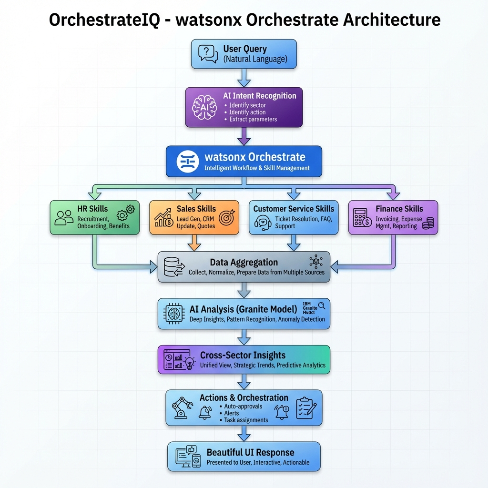

## 📊 Features

- **600+ Use Cases** across 4 sectors
- **Cross-Sector Analysis** - Identify relationships between sectors
- **Action Automation** - Auto-approvals, alerts, task assignments
# OrchestrateIQ - AI-Powered Business Command Center



An intelligent AI agent solution using IBM watsonx Orchestrate to orchestrate workflows across HR, Sales, Customer Service, and Finance sectors. This solution demonstrates cross-sector intelligence, proactive orchestration, and actionable automation.

## 📚 Key Documentation

- **[QUICK_START.md](docs/setup/QUICK_START.md)** - ⚡ 5-minute setup guide (START HERE!)
- **[docs/analysis/MARKET_ANALYSIS.md](docs/analysis/MARKET_ANALYSIS.md)** - Competitive analysis and unique value proposition
- **[docs/examples/EXAMPLE_QUERIES.md](docs/examples/EXAMPLE_QUERIES.md)** - 675+ example queries
- **[docs/todo/TODO.md](docs/todo/TODO.md)** - Project roadmap and tasks
- **[VISUALIZATION_GUIDE.md](docs/guides/VISUALIZATION_GUIDE.md)** - Smart visualization options
- **[IBM_WATSONX_SETUP.md](docs/setup/IBM_WATSONX_SETUP.md)** - Complete IBM setup guide

## 🎯 Unique Value Proposition

**OrchestrateIQ** is not just a dashboard—it's an intelligent orchestrator that:
- Identifies cross-sector relationships and patterns
- Proactively triggers workflows and automates actions
- Handles complex, multi-sector queries in natural language
- Automates approvals, routing, and coordination across systems

## 🏗️ Architecture

- **Backend**: Python FastAPI with watsonx Orchestrate integration
- **Frontend**: React.js with beautiful dual themes (Galaxy Dark / Antigravity Light)
- **AI**: IBM watsonx Orchestrate + watsonx.ai (Granite models)
- **Data**: Mock CSV/Excel datasets for demonstration

## 🚀 Quick Start

### Prerequisites
- Python 3.9+
- Node.js 16+
- IBM watsonx Orchestrate API credentials
- IBM watsonx.ai API credentials (optional)

### Installation

1. **Backend Setup**:
```bash
cd backend
pip install -r requirements.txt
cp .env.example .env
# Add your watsonx credentials to .env
```

2. **Frontend Setup**:
```bash
cd frontend
npm install
```

3. **Run Backend**:
```bash
cd backend
uvicorn app.main:app --reload
```

4. **Run Frontend**:
```bash
cd frontend
npm start
```

## 📊 Features

- **8+ Use Cases** across 4 sectors
- **Cross-Sector Analysis** - Identify relationships between sectors
- **Action Automation** - Auto-approvals, alerts, task assignments
- **Beautiful UI** - Galaxy dark theme and Antigravity light theme
- **Real-time Updates** - Live dashboard updates
- **Comprehensive Logging** - Debug logs at every stage

## 📚 Full Documentation

- **[docs/setup/QUICK_START.md](docs/setup/QUICK_START.md)** - ⚡ 5-minute setup guide (START HERE!)
- **[docs/examples/EXAMPLE_QUERIES.md](docs/examples/EXAMPLE_QUERIES.md)** - 675+ example queries
- **[docs/guides/VISUALIZATION_GUIDE.md](docs/guides/VISUALIZATION_GUIDE.md)** - Smart visualization options
- **[docs/setup/IBM_WATSONX_SETUP.md](docs/setup/IBM_WATSONX_SETUP.md)** - Complete IBM setup guide
- **[docs/setup/SETUP.md](docs/setup/SETUP.md)** - Detailed setup instructions
- **[docs/api/API.md](docs/api/API.md)** - API documentation
- **[docs/guides/DEBUG.md](docs/guides/DEBUG.md)** - Debug logging guide
- **[docs/guides/DEPLOYMENT.md](docs/guides/DEPLOYMENT.md)** - Deployment instructions
- **[docs/guides/VERSIONING.md](docs/guides/VERSIONING.md)** - Version management guide
- **[docs/meta/CHANGELOG.md](docs/meta/CHANGELOG.md)** - Version history and changes

## ⚠️ Important Notes

**Prohibited Models** (Do NOT use):
- llama-3-405b-instruct
- mistral-medium-2505
- mistral-small-3-1-24b-instruct-2503

**Approved Models**:
- IBM Granite models (via watsonx.ai)
- Models available through watsonx Orchestrate

## 📁 Project Structure

```
IBMWATSON/
├── backend/          # FastAPI backend
├── frontend/         # React frontend
├── docs/             # Documentation & Diagrams
│   ├── analysis/     # Market Analysis
│   ├── api/          # API Documentation
│   ├── examples/     # Example Queries
│   ├── guides/       # User & Dev Guides
│   ├── meta/         # Project Meta (Changelog, Contributing)
│   ├── setup/        # Setup Instructions
│   └── todo/         # Project Tasks
└── README.md         # This file
```

## 🤝 Contributing

See [docs/meta/CONTRIBUTING.md](docs/meta/CONTRIBUTING.md) for development guidelines.

## 📝 License

This project is created for IBM watsonx Orchestrate Hackathon.


